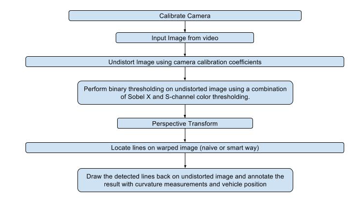
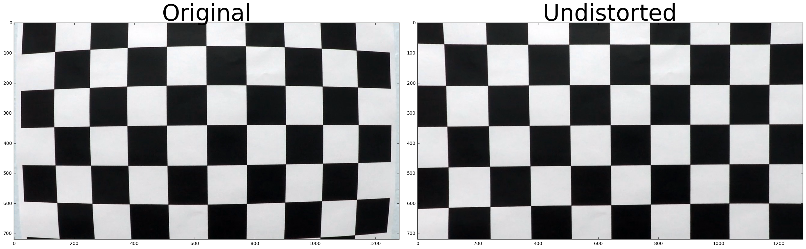
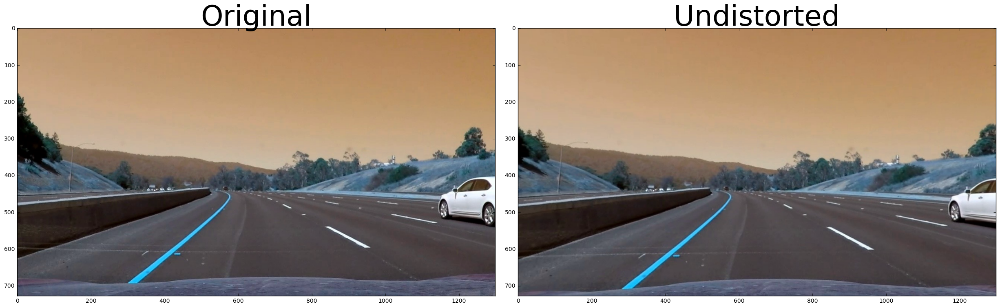
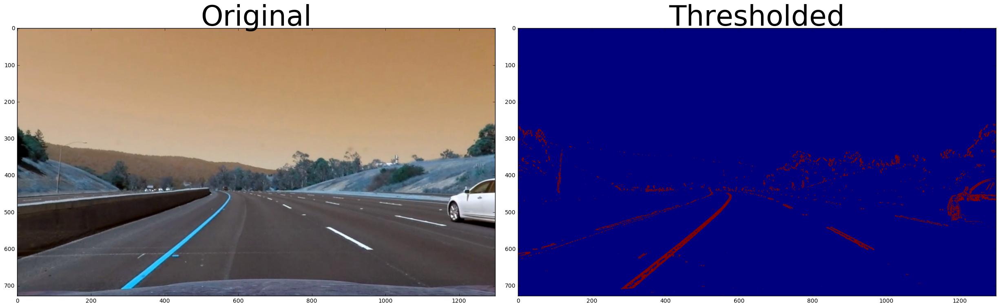
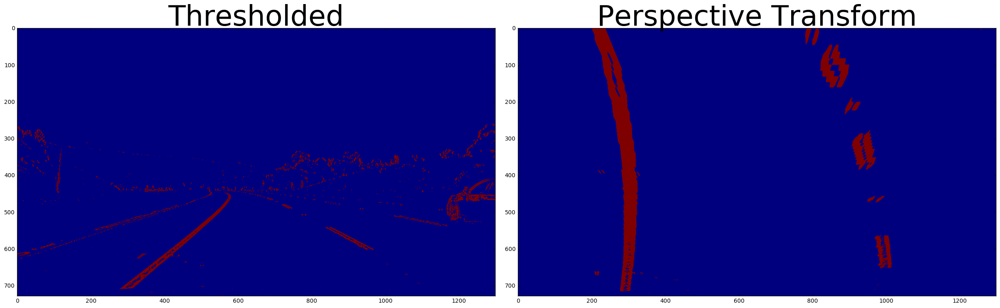
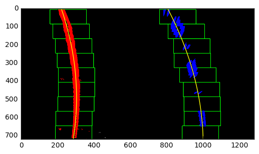
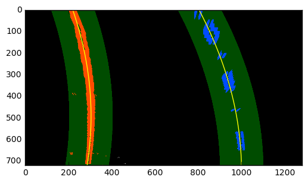
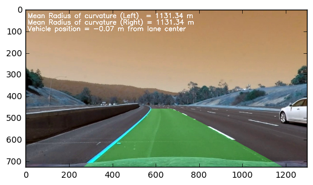

# **Advanced Lane Lines Detection on the Road** 
***
In this project, we write a software pipeline to identify the lane boundaries in a video from a front-facing camera on a car. 

## **Overview**

Here is just an over view of the pipeline. We provide details below.

<p align="center">
 
</p>

---

## **Camera Calibration**

We calibrate the camera using the example images provided in `/camera_cal/calibration*.jpg`. These are chessboard images. 

1. We convert image to gray scale using `cv2.cvtColor(img, cv2.COLOR_BGR2GRAY)`
1. We start by preparing object points, which will be the (x, y, z) coordinates of the chessboard corners in the world. We prepare object points like (0,0,0), (1,0,0), (2,0,0) ....,(6,5,0) such that the object points are the same for each calibration image.
2. Every time we successfully detect all chessboard corners in a test image, imgpoints will be appended with the corners returned by `cv2.findChessboardCorners`.

We then use these object and image points to compute the camera calibration and distortion coefficients using the cv2.calibrateCamera() function.

Example of undistortion from camera calibration

<p align="center">
 
</p>


```python
import numpy as np
import cv2
import matplotlib.pyplot as plt
import matplotlib.image as mpimg
import pickle
import glob
from moviepy.editor import VideoFileClip
```


```python
# globals
mtx = None
dist = None
M = None
Minv = None
line_prev = None
num_full_search = 0
```


```python
# Display util methods.
def display(img, tag1, undist, tag2):
    f, (ax1, ax2) = plt.subplots(1, 2, figsize=(24, 9))
    f.tight_layout()
    ax1.imshow(img)
    ax1.set_title(tag1, fontsize=50)
    ax2.imshow(undist)
    ax2.set_title(tag2, fontsize=50)
    plt.subplots_adjust(left=0., right=1, top=0.9, bottom=0.)
    plt.show()
```


```python
def find_corners(images):
    # prepare object points, like (0,0,0), (1,0,0), (2,0,0) ....,(6,5,0)
    objp = np.zeros((6*9,3), np.float32)
    objp[:,:2] = np.mgrid[0:9, 0:6].T.reshape(-1,2)

    # Arrays to store object points and image points from all the images.
    objpoints = [] # 3d points in real world space
    imgpoints = [] # 2d points in image plane.
    
    image_dims = None
    # Step through the list and search for chessboard corners
    for idx, fname in enumerate(images):
        img = cv2.imread(fname)
        gray = cv2.cvtColor(img, cv2.COLOR_BGR2GRAY)

        # Find the chessboard corners
        ret, corners = cv2.findChessboardCorners(gray, (9,6), None)

        # If found, add object points, image points
        if ret == True:
            objpoints.append(objp)
            imgpoints.append(corners)
            image_dims = (img.shape[0], img.shape[1])

    return objpoints, imgpoints, image_dims

def calibrate_camera(path):
    images = glob.glob(path)
    objpoints, imgpoints, image_dims = find_corners(images)
    ret, mtx, dist, rvecs, tvecs = cv2.calibrateCamera(objpoints, imgpoints, image_dims, None, None)
    return mtx, dist

def cal_undistort(img, mtx, dist):
    undist = cv2.undistort(img, mtx, dist, None, mtx)
    return undist

mtx, dist = calibrate_camera("./camera_cal/calibration*.jpg")
img = cv2.imread('./camera_cal/calibration1.jpg')
undist_img = cal_undistort(img, mtx, dist)
display(img, 'Original', undist_img, 'Undistorted')
```

## **Pipeline (test images)**

### **Distortion Correction**

We apply distortion correction to one of the test images. The differences are subtle and most noticeable around the edges.

<p align="center">
 
</p>


```python
img = cv2.imread('./camera_cal/distorted.png')
undist_img = cal_undistort(img, mtx, dist)
display(img, 'Original', undist_img, 'Undistorted')
```

### **Binary Thresholding**

We do combined thresholding using two different techniques.

1. Sobel X
2. Thresholding in HLS color space.

We take the input RGB image, convert it to grayscale. We then apply a Sobel filter in the X direction to get image edges that match the direction of the lane lines.  Taking the gradient in the x-direction emphasizes edges closer to vertical. We then apply a threshold function on this to filter out out pixels that are not of interest. Through trial and error, we settled on min/max threshold values of 30 and 150.

We convert the RGB image to the HLS color space, and then use the S channel. The S saturation channel is useful for picking out lane lines under different color and contrast conditions, such as shadows. Through experiments, we found values of 175 and 250 to work best here.

<p align="center">
 
</p>


```python
def abs_sobel_thresh(gray, orient='x', sobel_kernel=3, thresh=(0, 255)):
    
    # Apply the following steps to img
    # 1) Convert to grayscale
    # 2) Take the derivative in x or y given orient = 'x' or 'y'
    # 3) Take the absolute value of the derivative or gradient
    # 4) Scale to 8-bit (0 - 255) then convert to type = np.uint8
    # 5) Create a mask of 1's where the scaled gradient magnitude 
            # is > thresh_min and < thresh_max
    # 6) Return this mask as your binary_output image
    sobel = None
    if orient == 'x':
        sobel = cv2.Sobel(gray, cv2.CV_64F, 1, 0, ksize=sobel_kernel)
    else:
        sobel = cv2.Sobel(gray, cv2.CV_64F, 0, 1, ksize=sobel_kernel)
    abs_sobel = np.absolute(sobel)
    scaled_sobel = np.uint8(255*abs_sobel/np.max(abs_sobel))
    binary_output = np.zeros_like(scaled_sobel)
    binary_output[(scaled_sobel >= thresh[0]) & (scaled_sobel <= thresh[1])] = 1
    return binary_output

def binary_thresholding(img, s_thresh=(175, 250), sx_thresh=(30, 150)):
    # Convert to HSV color space and separate the V channel
    gray = cv2.cvtColor(img, cv2.COLOR_RGB2GRAY)
    hsv = cv2.cvtColor(img, cv2.COLOR_RGB2HLS).astype(np.float)
    l_channel = hsv[:,:,1]
    s_channel = hsv[:,:,2]
    # Sobel
    ksize = 3
    sobel = abs_sobel_thresh(gray, orient='x', sobel_kernel=ksize, thresh=sx_thresh)
    # Threshold color channel
    s_binary = np.zeros_like(s_channel)
    s_binary[(s_channel >= s_thresh[0]) & (s_channel <= s_thresh[1])] = 1
    combined = np.zeros_like(gray)
    combined[(s_binary == 1) | (sobel == 1)] = 1
    return combined

s_thresh = (175, 250)
sx_thresh = (30, 150)
binary_threshold = binary_thresholding(undist_img, s_thresh=s_thresh, sx_thresh=sx_thresh)
display(undist_img, 'Original', binary_threshold, 'Combined Binary Thresholding')
```

### **Perspective Transform**

Once we have the binary threshold image above, we apply a perspective transform on the image to generate an image with the effect of looking down on the road from above. OpenCV warpPerspective() function is used to do this. Through some experiements (and based on some of the CarND slack channel discussions) we settled on following coordinates:

1. Source - [220,719],[1220,719],[750,480],[550,480]
2. Destination - [240,719],[1040,719],[1040,300],[240,300]

OpenCV getPerspectiveTransform() function generates a perspective matrix using these coordinates. After we have applied the perspective transform to the binary threshold image, we get an image that looks that lanes from above, like so.

<p align="center">
 
</p>


```python
def perspective_transform(img):
    # define 4 source points for perspective transformation
    src = np.float32([[220,719],[1220,719],[750,480],[550,480]])
    # define 4 destination points for perspective transformation
    dst = np.float32([[240,719],[1040,719],[1040,300],[240,300]])
    # Given src and dst points, calculate the perspective transform matrix
    M = cv2.getPerspectiveTransform(src, dst)
    # Warp the image using OpenCV warpPerspective()
    warped = cv2.warpPerspective(img, M, (img.shape[1], img.shape[0]))
    # Return the resulting image
    return warped, M

binary_warped, M = perspective_transform(binary_threshold)
display(binary_threshold, 'Thresholded', binary_warped, 'Perspective Transform')
```

### **Locate Lines and Polynomial fit**

In this stage is where we extract the actual lane pixels for both the left and right lanes from the above perspective transformed (bird's eye view) image. We use the peak histogram technique described in the lectures. We also borrow some code from the lectures. There are two ways of locating lines in an image. 

1. Naive approach (we brute force search across the image using the histogram technique)
2. Smart approach (we use the line location from the previous image)

We start with (1) and resort to (1) when we get "lost". We will cover what it means to be lost below. We first take a histogram along all the columns in the lower half of the image. With this histogram we are adding up the pixel values along each column in the image. In thresholded binary image, pixels are either 0 or 1, so the two most prominent peaks in this histogram will be good indicators of the x-position of the base of the lane lines. We can use that as a starting point for where to search for the lines. From that point onwards, we use a sliding window, placed around the line centers, to find and follow the lines up to the top of the frame. The following image shows how this search works.

<p align="center">
 
</p>

In (2), when we use the smart approach and pick up the search from around the lines detected in the previous frame instead of searching all across the bottom of the image for lane start. It looks like this.

<p align="center">
 
</p>

Once we have detected the lane pixes (for both left and right lanes) we use `numpy.polyfit` to fit a polynomial for these pixel positions.


```python
class Line():
    # We use this class to hold the details of the located lines and polynomial fit for each image.
    def __init__(self):
        self.fullsearch = False  
        self.left_lane_inds = None 
        self.right_lane_inds = None   
        self.left_fit = None  
        self.right_fit = None 
        self.left_fit_cr = None  
        self.right_fit_cr = None 
        self.yvals = None
        self.left_fitx = None
        self.right_fitx = None
        self.y_bottom = None
        self.y_top = None
        self.left_x_bottom = None
        self.left_x_top = None
        self.right_x_bottom = None
        self.right_x_top = None
        self.left_curverads = None
        self.right_curverads = None
        self.mean_left_curverad = None
        self.mean_right_curverad = None

def display_poly_fit(binary_warped, left_lane_inds, right_lane_inds, out_img, plotSearchArea=False):
    left_fit, right_fit = fit_curve(binary_warped, left_lane_inds, right_lane_inds)
    nonzero = binary_warped.nonzero()
    nonzeroy = np.array(nonzero[0])
    nonzerox = np.array(nonzero[1])
    margin = 100
    # Generate x and y values for plotting
    fity = np.linspace(0, binary_warped.shape[0]-1, binary_warped.shape[0] )
    fit_leftx = left_fit[0]*fity**2 + left_fit[1]*fity + left_fit[2]
    fit_rightx = right_fit[0]*fity**2 + right_fit[1]*fity + right_fit[2]
    # Color in left and right line pixels
    out_img[nonzeroy[left_lane_inds], nonzerox[left_lane_inds]] = [255, 0, 0]
    out_img[nonzeroy[right_lane_inds], nonzerox[right_lane_inds]] = [0, 0, 255]

    result = None
    if plotSearchArea == True:
        window_img = np.zeros_like(out_img)
        # Generate a polygon to illustrate the search window area
        # And recast the x and y points into usable format for cv2.fillPoly()
        left_line_window1 = np.array([np.transpose(np.vstack([fit_leftx-margin, fity]))])
        left_line_window2 = np.array([np.flipud(np.transpose(np.vstack([fit_leftx+margin, fity])))])
        left_line_pts = np.hstack((left_line_window1, left_line_window2))
        right_line_window1 = np.array([np.transpose(np.vstack([fit_rightx-margin, fity]))])
        right_line_window2 = np.array([np.flipud(np.transpose(np.vstack([fit_rightx+margin, fity])))])
        right_line_pts = np.hstack((right_line_window1, right_line_window2))

        # Draw the lane onto the warped blank image
        cv2.fillPoly(window_img, np.int_([left_line_pts]), (0,255, 0))
        cv2.fillPoly(window_img, np.int_([right_line_pts]), (0,255, 0))
        result = cv2.addWeighted(out_img, 1, window_img, 0.3, 0)
    else:
        result = out_img

    plt.imshow(result)
    plt.plot(fit_leftx, fity, color='yellow')
    plt.plot(fit_rightx, fity, color='yellow')
    plt.xlim(0, 1280)
    plt.ylim(720, 0)
    plt.show()
    
def draw_lines(undist, warped, yvals, left_fitx, right_fitx, Minv):
    # Create an image to draw the lines on
    warp_zero = np.zeros_like(warped).astype(np.uint8)
    color_warp = np.dstack((warp_zero, warp_zero, warp_zero))

    # Recast the x and y points into usable format for cv2.fillPoly()
    pts_left = np.array([np.transpose(np.vstack([left_fitx, yvals]))])
    pts_right = np.array([np.flipud(np.transpose(np.vstack([right_fitx, yvals])))])
    pts = np.hstack((pts_left, pts_right))

    # Draw the lane onto the warped blank image
    cv2.fillPoly(color_warp, np.int_([pts]), (0,255, 0))

    # Warp the blank back to original image space using inverse perspective matrix (mtxinv)
    newwarp = cv2.warpPerspective(color_warp, Minv, (color_warp.shape[1], color_warp.shape[0])) 
    # Combine the result with the original image
    result = cv2.addWeighted(undist, 1, newwarp, 0.3, 0)
    return result

def naive_find_lines(binary_warped):
    # Take a histogram of the bottom half of the image
    histogram = np.sum(binary_warped[binary_warped.shape[0]/2:,:], axis=0)
    # Create an output image to draw on and  visualize the result
    out_img = np.dstack((binary_warped, binary_warped, binary_warped))*255
    # Find the peak of the left and right halves of the histogram
    # These will be the starting point for the left and right lines
    midpoint = np.int(histogram.shape[0]/2)
    leftx_base = np.argmax(histogram[:midpoint])
    rightx_base = np.argmax(histogram[midpoint:]) + midpoint

    # Choose the number of sliding windows
    nwindows = 9
    # Set height of windows
    window_height = np.int(binary_warped.shape[0]/nwindows)
    # Identify the x and y positions of all nonzero pixels in the image
    nonzero = binary_warped.nonzero()
    nonzeroy = np.array(nonzero[0])
    nonzerox = np.array(nonzero[1])
    # Current positions to be updated for each window
    leftx_current = leftx_base
    rightx_current = rightx_base
    # Set the width of the windows +/- margin
    margin = 100
    # Set minimum number of pixels found to recenter window
    minpix = 50
    # Create empty lists to receive left and right lane pixel indices
    left_lane_inds = []
    right_lane_inds = []

    # Step through the windows one by one
    for window in range(nwindows):
        # Identify window boundaries in x and y (and right and left)
        win_y_low = binary_warped.shape[0] - (window+1)*window_height
        win_y_high = binary_warped.shape[0] - window*window_height
        win_xleft_low = leftx_current - margin
        win_xleft_high = leftx_current + margin
        win_xright_low = rightx_current - margin
        win_xright_high = rightx_current + margin
        # Draw the windows on the visualization image
        cv2.rectangle(out_img,(win_xleft_low,win_y_low),(win_xleft_high,win_y_high),(0,255,0), 2) 
        cv2.rectangle(out_img,(win_xright_low,win_y_low),(win_xright_high,win_y_high),(0,255,0), 2) 
        # Identify the nonzero pixels in x and y within the window
        good_left_inds = ((nonzeroy >= win_y_low) & (nonzeroy < win_y_high) & (nonzerox >= win_xleft_low) & (nonzerox < win_xleft_high)).nonzero()[0]
        good_right_inds = ((nonzeroy >= win_y_low) & (nonzeroy < win_y_high) & (nonzerox >= win_xright_low) & (nonzerox < win_xright_high)).nonzero()[0]
        # Append these indices to the lists
        left_lane_inds.append(good_left_inds)
        right_lane_inds.append(good_right_inds)
        # If you found > minpix pixels, recenter next window on their mean position
        if len(good_left_inds) > minpix:
            leftx_current = np.int(np.mean(nonzerox[good_left_inds]))
        if len(good_right_inds) > minpix:        
            rightx_current = np.int(np.mean(nonzerox[good_right_inds]))

    # Concatenate the arrays of indices
    left_lane_inds = np.concatenate(left_lane_inds)
    right_lane_inds = np.concatenate(right_lane_inds)

    return left_lane_inds, right_lane_inds, out_img

def smart_find_lines(binary_warped, left_fit, right_fit):
    nonzero = binary_warped.nonzero()
    nonzeroy = np.array(nonzero[0])
    nonzerox = np.array(nonzero[1])

    margin = 100
    left_lane_inds = ((nonzerox > (left_fit[0]*(nonzeroy**2) + 
        left_fit[1]*nonzeroy + left_fit[2] - margin)) & 
    (nonzerox < (left_fit[0]*(nonzeroy**2) + left_fit[1]*nonzeroy + left_fit[2] + margin))) 
    right_lane_inds = ((nonzerox > (right_fit[0]*(nonzeroy**2) + 
        right_fit[1]*nonzeroy + right_fit[2] - margin)) & 
    (nonzerox < (right_fit[0]*(nonzeroy**2) + right_fit[1]*nonzeroy + right_fit[2] + margin)))  

    # Again, extract left and right line pixel positions
    leftx = nonzerox[left_lane_inds]
    lefty = nonzeroy[left_lane_inds] 
    rightx = nonzerox[right_lane_inds]
    righty = nonzeroy[right_lane_inds]
    # Fit a second order polynomial to each
    left_fit_new = np.polyfit(lefty, leftx, 2)
    right_fit_new = np.polyfit(righty, rightx, 2)

    # Create an image to draw on and an image to show the selection window
    out_img = np.dstack((binary_warped, binary_warped, binary_warped))*255
    return left_lane_inds, right_lane_inds, out_img    

def fit_curve(binary_warped, left_lane_inds, right_lane_inds):
    nonzero = binary_warped.nonzero()
    nonzeroy = np.array(nonzero[0])
    nonzerox = np.array(nonzero[1])
    # Extract left and right line pixel positions
    leftx = nonzerox[left_lane_inds]
    lefty = nonzeroy[left_lane_inds] 
    rightx = nonzerox[right_lane_inds]
    righty = nonzeroy[right_lane_inds] 
    # Fit a second order polynomial to each
    left_fit = np.polyfit(lefty, leftx, 2)
    right_fit = np.polyfit(righty, rightx, 2)
    return left_fit, right_fit

def process_fit(binary_warped, left_lane_inds, right_lane_inds):
    left_fit, right_fit = fit_curve(binary_warped, left_lane_inds, right_lane_inds)
    left_fit_cr, right_fit_cr = fit_pixel_to_meters(binary_warped, left_lane_inds, right_lane_inds)
    yvals, left_fitx, right_fitx = fit_lines(binary_warped, left_fit, right_fit)

    line = Line()
    line.left_lane_inds = left_lane_inds
    line.right_lane_inds = right_lane_inds
    line.left_fit = left_fit
    line.right_fit = right_fit
    line.left_fit_cr = left_fit_cr
    line.right_fit_cr = right_fit_cr
    line.yvals = yvals
    line.left_fitx = left_fitx
    line.right_fitx = right_fitx
    line.y_bottom = np.min(yvals)
    line.y_top = np.max(yvals)
    line.left_x_bottom = left_fit[0]*line.y_bottom**2 + left_fit[1]*line.y_bottom + left_fit[2]
    line.left_x_top = left_fit[0]*line.y_top**2 + left_fit[1]*line.y_top + left_fit[2]
    line.right_x_bottom = right_fit[0]*line.y_bottom**2 + right_fit[1]*line.y_bottom + right_fit[2]
    line.right_x_top = right_fit[0]*line.y_top**2 + right_fit[1]*line.y_top + right_fit[2]
    left_curverads, right_curverads = radius_of_curvatures(line.yvals, left_fit_cr, right_fit_cr)
    line.left_curverads = left_curverads
    line.right_curverads = right_curverads
    line.mean_left_curverad = np.mean(left_curverads)
    line.mean_right_curverad = np.mean(right_curverads)

    return line

def fit_lines(binary_warped, left_fit, right_fit):
    yvals = np.linspace(0, binary_warped.shape[0]-1, binary_warped.shape[0] )
    left_fitx = left_fit[0]*yvals**2 + left_fit[1]*yvals + left_fit[2]
    right_fitx = right_fit[0]*yvals**2 + right_fit[1]*yvals + right_fit[2]
    return yvals, left_fitx, right_fitx

# naive search
left_lane_inds, right_lane_inds, out_img = naive_find_lines(binary_warped)
line = process_fit(binary_warped, left_lane_inds, right_lane_inds)
display_poly_fit(binary_warped, left_lane_inds, right_lane_inds, out_img, False)

# smart search (we are faking it here)
left_lane_inds, right_lane_inds, out_img = smart_find_lines(binary_warped, line.left_fit, line.right_fit)
line = process_fit(binary_warped, left_lane_inds, right_lane_inds)
display_poly_fit(binary_warped, left_lane_inds, right_lane_inds, out_img, True)
```

### **Curvature of the lane and vehicle position with respect to center**

Next we'll compute the radius of curvature of the poly fit done above. However that polynomial fit is in pixel space. In order to calculate the curvature in real space (in meters) we convert pixels to meters and do the polynomial fit. It is just a simple conversion of units. So we actually need to repeat this calculation after converting our x and y values to real world space. This involves measuring how long and wide the section of lane is that we're projecting in our warped image. We could do this in detail by measuring out the physical lane in the field of view of the camera, but for this project, we use the values provided in lectures. The lane is about 30 meters long and 3.7 meters wide. So on y dimension a pixel is 30/720 meters and on x dimension, a pixel is 3.7/700 meters. We use the mean curvature across the line.

To calculate the offset from centre, we use the bottom x values for the lanes, i.e, where on the x plane, both the left and right lanes crossed the image near the driver. We then calculate the center of the image as the width/2. The offset was calculated as `(rx - xcenter) - (xcenter - lx)` and converted to meters using the pixel to meters conversion stated above.

The result of all this, once plotted back on undistorted image (located lines drawn based on poly fit and projected back from warped perspective) looks like this:

<p align="center">
 
</p>


```python
def fit_pixel_to_meters(binary_warped, left_lane_inds, right_lane_inds):
    nonzero = binary_warped.nonzero()
    nonzeroy = np.array(nonzero[0])
    nonzerox = np.array(nonzero[1])
    # Again, extract left and right line pixel positions
    leftx = nonzerox[left_lane_inds]
    lefty = nonzeroy[left_lane_inds] 
    rightx = nonzerox[right_lane_inds]
    righty = nonzeroy[right_lane_inds]
    # Define conversions in x and y from pixels space to meters
    ym_per_pix = 30/720 # meters per pixel in y dimension
    xm_per_pix = 3.7/700 # meters per pixel in x dimension
    # Fit new polynomials to x,y in world space
    left_fit_cr = np.polyfit(lefty*ym_per_pix, leftx*xm_per_pix, 2)
    right_fit_cr = np.polyfit(righty*ym_per_pix, rightx*xm_per_pix, 2)
    return left_fit_cr, right_fit_cr

def radius_of_curvatures(yvals, left_fit, right_fit):
    left_curverads = ((1 + (2*left_fit[0]*yvals + left_fit[1])**2)**1.5) / np.absolute(2*left_fit[0])
    right_curverads = ((1 + (2*right_fit[0]*yvals + right_fit[1])**2)**1.5) / np.absolute(2*right_fit[0])
    return left_curverads, right_curverads

def annotate_result(result, line):
    lx = line.left_x_top
    rx = line.right_x_top
    xcenter = np.int(result.shape[1]/2)
    offset = (rx - xcenter) - (xcenter - lx) 
    xm_per_pix = 3.7/700 # meters per pixel in x dimension
    vehicle_offset =  offset * xm_per_pix

    font = cv2.FONT_HERSHEY_SIMPLEX
    cv2.putText(result, 'Mean Radius of curvature (Left)  = %.2f m' % (line.mean_left_curverad), 
        (10, 40), font, 1, (255, 255, 255), 2, cv2.LINE_AA)
    cv2.putText(result, 'Mean Radius of curvature (Right) = %.2f m' % (line.mean_left_curverad), 
        (10, 70), font, 1, (255, 255, 255), 2, cv2.LINE_AA)
    cv2.putText(result, 'Vehicle position = %.2f m from lane center' % (vehicle_offset), 
               (10, 100), font, 1, (255, 255, 255), 2, cv2.LINE_AA)
    return result

result = draw_lines(undist_img, binary_warped, line.yvals, line.left_fitx, line.right_fitx, np.linalg.inv(M))
annotated_result = annotate_result(result, line)
plt.imshow(result)
plt.show()
```

#### **Why Smart ?**

Doing the naive search on each frame is expensive. If we assume the camera is capturing 30 frames a second, there should be no reason why we cannot leverage the lane location from previous frame on to next frame.

Once we have calculated for a given frame:

1) X positions where lanes intersect the bottom of the frame.
2) Mean radius of curvature of lanes

For (1), we can check that these have not changed too much from frame to frame. If you think about it, at 30 frames per second from a camera, the lanes should not change too much from frame to frame. We check for a 15 pixel delta.

For (2), we check that each lanes Radius of Curvature is within 100 times (larger or smaller) than the previous frames values. As the RoC can be very large for vertical lines, so 100x check seems to work.

If any of the above checks fail for a lane, I consider the lane ‘lost’ and we do a naive search.

## **Video Pipeline**

Putting it all together, we use `moviepy` software to run the pipeline on each image. You can see the output video here: (https://youtu.be/MuK4aSims0Q)


```python
def is_good_fit(prev, curr):
    # check if left_x_bottom and right_x_bottom are within 15 pixels
    if abs(prev.left_x_bottom - curr.left_x_bottom) <= 15: 
        if abs(prev.right_x_bottom - curr.right_x_bottom) <= 15:
                if abs(curr.mean_left_curverad) < (abs(prev.mean_left_curverad*100)):
                    if abs(curr.mean_right_curverad) < (abs(prev.mean_left_curverad*100)):
                        return True
    return False

def process_image(img):
    global mtx, dist, line_prev, num_full_search
    if mtx is None or dist is None:
         mtx, dist = calibrate_camera("./camera_cal/calibration*.jpg")
    undist_img = cal_undistort(img, mtx, dist)
    s_thresh = (175, 250)
    sx_thresh = (30, 150)
    binary_threshold = binary_thresholding(undist_img, s_thresh=s_thresh, sx_thresh=sx_thresh)
    binary_warped, M = perspective_transform(binary_threshold)

    left_lane_inds = None
    right_lane_inds = None
    out_img = None
    plotSearchArea = True
    line = None
    if line_prev is None:
        left_lane_inds, right_lane_inds, out_img = naive_find_lines(binary_warped)
        plotSearchArea = False
        line = process_fit(binary_warped, left_lane_inds, right_lane_inds)
        num_full_search = num_full_search + 1
    else:
        left_lane_inds, right_lane_inds, out_img = smart_find_lines(binary_warped, 
            line_prev.left_fit, line_prev.right_fit)
        line = process_fit(binary_warped, left_lane_inds, right_lane_inds)
        # check for a good fit
        if is_good_fit(line_prev, line) is False:
            left_lane_inds, right_lane_inds, out_img = naive_find_lines(binary_warped)
            plotSearchArea = False
            line = process_fit(binary_warped, left_lane_inds, right_lane_inds)
            num_full_search = num_full_search + 1

    result = draw_lines(undist_img, binary_warped, line.yvals, line.left_fitx, line.right_fitx, np.linalg.inv(M))

    annotated_result = annotate_result(result, line)

    #display(img, 'Original', binary_threshold, 'Thresholded')
    #display(binary_threshold, 'Thresholded', binary_warped, 'Transformed')
    #display_poly_fit(binary_warped, left_lane_inds, right_lane_inds, out_img, plotSearchArea)
    #plt.imshow(result)
    #plt.show()

    line_prev = line
    return annotated_result

def process_video():
    global num_full_search
    output = 'project_output.mp4'
    clip1 = VideoFileClip("project_video.mp4")
    output_clip = clip1.fl_image(process_image)
    output_clip.write_videofile(output, audio=False)
    print("Num full searches", num_full_search)

process_video()
```

## **Discussion**

There are several places where we have some hardcoded heuristics. They are:

1. The warp perspective coordinates are heuristics tuned based on the project video and its camera perspective. If we need this to generalize then we need to an automated way to detect these coordinates based on camera angles.

2. The binary threshoding coefficients once again were tuned for this video. While this does generalize some, it has limitations. We need a more generic solution if this needs to work on any terrain, any kind of lighting, rain, snow etc.

3. My "smart" line detection only takes into previous frame. There is no reason why this cannot be a sliding window of last N frames and the poly fit coefficients can be averaged over last N frames. This might generalize better and would prevent lane from jumping too much on challenge videos.
