# **Vehicle Detection** 
***
In this project, we write a software pipeline to identify vehicles in a video from a front-facing camera on a car. 

## **Overview**

Here is just an over view of the pipeline. We provide details below.

---


```python
import os
import numpy as np
import cv2
import matplotlib.pyplot as plt
import matplotlib.image as mpimg
from moviepy.editor import VideoFileClip
import pickle
import glob
import time
from skimage.feature import hog
from sklearn.preprocessing import StandardScaler
from sklearn.svm import LinearSVC
from sklearn.cross_validation import train_test_split
from scipy.ndimage.measurements import label
from scipy.ndimage import generate_binary_structure
from collections import deque
from numpy import linalg as LA
```

## **Visualizing Data**

First step in any analysis is to understand the data set. Here we will visualize a few of of the car and non-car samples. The images are 64x64 pixels in dimension.

<p align="center">
 
</p>


```python
car1 = cv2.imread("./test_data/vehicles_smallset/cars1/1.jpeg")
car2 = cv2.imread("./test_data/vehicles/GTI_Far/image0000.png")
noncar1 = cv2.imread("./test_data/non-vehicles_smallset/notcars1/extra00.jpeg")
noncar2 = cv2.imread("./test_data/non-vehicles/Extras/extra27.png")

fig = plt.figure()
ax1 = fig.add_subplot(221)  #top left
ax1.imshow(car1)
ax2 = fig.add_subplot(222)  #top right
ax2.imshow(car2)
ax3 = fig.add_subplot(223)   #bottom left
ax3.imshow(noncar1)
ax4 = fig.add_subplot(224) 
ax4.imshow(noncar2)

plt.show()
```

## **Feature Extraction**

Lectures recommend that we use combination of features. 

### **Spatial Binning**

Using features directly from image pixels.


```python
# Define a function to compute binned color features  
def bin_spatial(img, size=(32, 32)):
    # Use cv2.resize().ravel() to create the feature vector
    features = cv2.resize(img, size).ravel() 
    # Return the feature vector
    return features
```

### **Color Histograms**
First we start with color space exploration. Just like using raw pixel intensities as features and we look at histograms of pixel intensity (color histograms) as features. We explore the color channel histograms for a sample car and non-car image for:

1. RGB color space (All three channels, RGB, give quite a distinctive signature between car and non-car histograms)
2. HSV color space (All three channels, HSV provide quite distinctive distributions between car and non-car image)
3. YCrCb color space (Y channel is distinctive between car and non-car images but Cr and Cb are rather close)

<p align="center">
 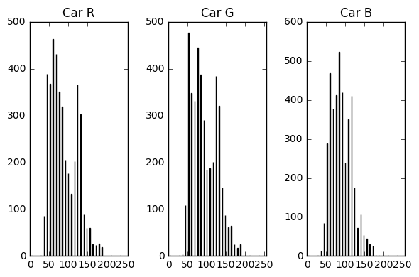
</p>

<p align="center">
 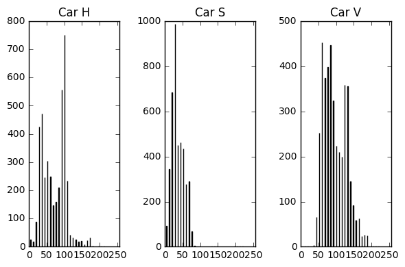
</p>

<p align="center">
 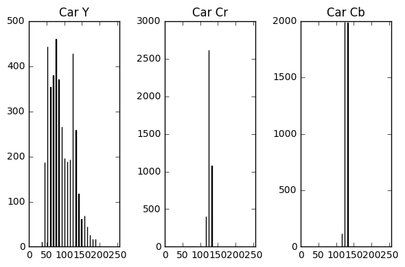
</p>


```python
# Define a function to compute color histogram features  
def color_hist(image, nbins=32, bins_range=(0, 256)):
    # Compute the histogram of the channels separately
    # Take histograms of each channel
    c1, c2, c3 = image[:,:,0], image[:,:,1], image[:,:,2]
    c1hist = np.histogram(c1, bins=nbins, range=bins_range)
    c2hist = np.histogram(c2, bins=nbins, range=bins_range)
    c3hist = np.histogram(c3, bins=nbins, range=bins_range)
    # Generating bin centers
    bin_edges = c1hist[1]
    bin_centers = (bin_edges[1:]  + bin_edges[0:len(bin_edges)-1])/2
    # Concatenate the histograms into a single feature vector
    hist_features = np.concatenate((c1hist[0], c2hist[0], c3hist[0]))
    # Return the individual histograms, bin_centers and feature vector
    return c1hist, c2hist, c3hist, bin_centers, hist_features

def display_color_histograms(c1, c2, c3, c1_label, c2_label, c3_label):
    plt.subplot(131)
    plt.bar(bincen, c1[0])
    plt.xlim(0, 256)
    plt.title(c1_label)
    plt.subplot(132)
    plt.bar(bincen, c2[0])
    plt.xlim(0, 256)
    plt.title(c2_label)
    plt.subplot(133)
    plt.bar(bincen, c3[0])
    plt.xlim(0, 256)
    plt.title(c3_label)
    plt.tight_layout()
    plt.show()
    
bins = 32
bins_range = (0, 256)
```

### **RGB**

All three channels, RGB, give quite a distinctive signature between car and non-car histograms.


```python
car_bgr = cv2.imread("./test_data/vehicles/GTI_Far/image0000.png")
noncar_bgr = cv2.imread("./test_data/non-vehicles/Extras/extra27.png")

car_b, car_g, car_r, bincen, feature_vec = color_hist(car_bgr, nbins=bins, bins_range=bins_range)
noncar_r, noncar_g, noncar_b, bincen, feature_vec = color_hist(noncar_bgr, nbins=bins, bins_range=bins_range)

display_color_histograms(car_r, car_g, car_b, 'Car R', 'Car G', 'Car B')
display_color_histograms(noncar_r, noncar_g, noncar_b, 'Non-Car R', 'Non-Car G', 'Non-Car B')
```

### **HSV**

All three channels, HSV provide quite distinctive distributions between car and non-car image.


```python
car_hsv = cv2.cvtColor(car_bgr, cv2.COLOR_BGR2HSV)
noncar_hsv = cv2.cvtColor(noncar_bgr, cv2.COLOR_BGR2HSV)

car_h, car_s, car_v, bincen, feature_vec = color_hist(car_hsv, nbins=bins, bins_range=bins_range)
noncar_h, noncar_s, noncar_v, bincen, feature_vec = color_hist(noncar_hsv, nbins=bins, bins_range=bins_range)

display_color_histograms(car_h, car_s, car_v, 'Car H', 'Car S', 'Car V')
display_color_histograms(noncar_h, noncar_s, noncar_v, 'Non-Car H', 'Non-Car S', 'Non-Car V')
```

### **YCrCb**

Y channel is distinctive between car and non-car images but Cr and Cb are rather close.


```python
car_ycrcb = cv2.cvtColor(car_bgr, cv2.COLOR_BGR2YCrCb)
noncar_ycrcb = cv2.cvtColor(noncar_bgr, cv2.COLOR_BGR2YCrCb)

car_y, car_cr, car_cb, bincen, feature_vec = color_hist(car_ycrcb, nbins=bins, bins_range=bins_range)
noncar_y, noncar_cr, noncar_cb, bincen, feature_vec = color_hist(noncar_ycrcb, nbins=bins, bins_range=bins_range)

display_color_histograms(car_y, car_cr, car_cb, 'Car Y', 'Car Cr', 'Car Cb')
display_color_histograms(noncar_y, noncar_cr, noncar_cb, 'Non-Car Y', 'Non-Car Cr', 'Non-Car Cb')
```

## **Histogram of oriented gradients (HOG)**

One can tune the following parameters while using HOG:

1. Number of Orientations - The number of orientations is specified as an integer, and represents the number of orientation bins that the gradient information will be split up into in the histogram. Typical values are between 6 and 12 bins.
2. Pixels per Cell - The pixels_per_cell parameter specifies the cell size over which each gradient histogram is computed.
3. Cells per Block - The cells_per_block parameter is also passed as a 2-tuple, and specifies the local area over which the histogram counts in a given cell will be normalized. Block normalization is not necessarily required, but generally leads to a more robust feature set.

We tried:

1. Orientations = 8, Pixel per cell = (8,8), cells per block = 2
2. Orientations = 9, Pixel per cell = (8,8), cells per block = 2
3. Orientations = 8, Pixel per cell = (16,16), cells per block = 2
4. Orientations = 9, Pixel per cell = (16,16), cells per block = 2

It turns out (1) and (2) are close. We go with (1) since it has fewer number of features. 

We also experimented with HOG features on color spaces. Following were tried:

1. HOG over gray scale (BGR-2-GRAY)
2. HOG over individual R, G, B channels.
3. HOG over individual H, S, V channels. In HSV, V channel is the equivalent of gray.
4. HOG over individual Y, Cr, Cb channels. In YCrCb, Y channle is the equivalent of gray.

The results are somewhat inconclusive. It looks like all three color spaces, provide the ability to distinguish between car and non car images using HOG features.

HOG RGB 
<p align="center">
 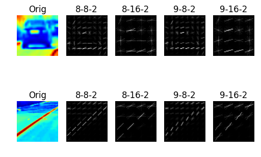
</p>

HOG R
<p align="center">
 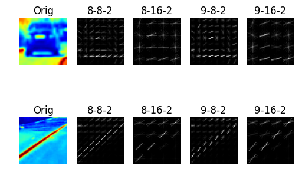
</p>

HOG G
<p align="center">
 
</p>

HOG B
<p align="center">
 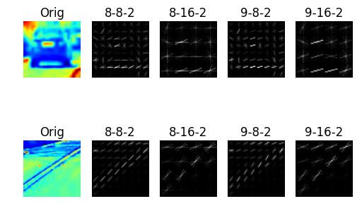
</p>

HOG H
<p align="center">
 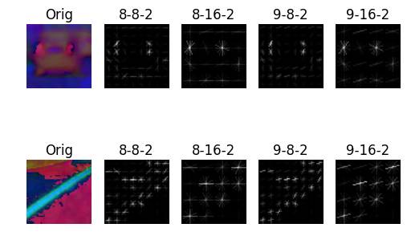
</p>

HOG S
<p align="center">
 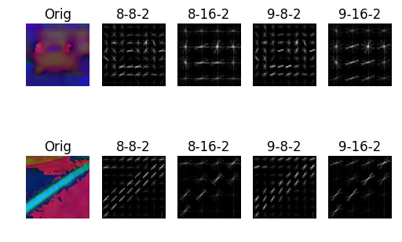
</p>

HOG V
<p align="center">
 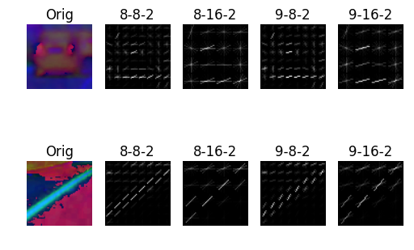
</p>

HOG Y
<p align="center">
 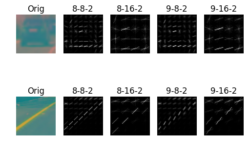
</p>

HOG Cr
<p align="center">
 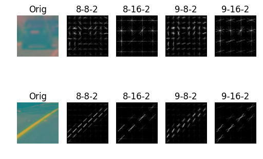
</p>

HOG Cb
<p align="center">
 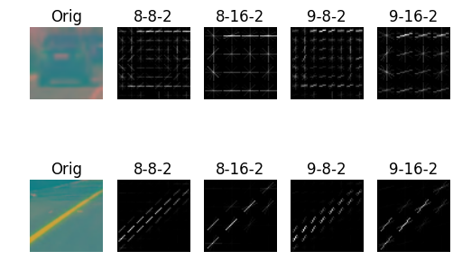
</p>


```python
# Define a function to return HOG features and visualization
def get_hog_features(img, orient, pix_per_cell, cell_per_block, 
                        vis=False, feature_vec=True):
    # Call with two outputs if vis==True
    if vis == True:
        features, hog_image = hog(img, orientations=orient, 
                                  pixels_per_cell=(pix_per_cell, pix_per_cell),
                                  cells_per_block=(cell_per_block, cell_per_block), 
                                  transform_sqrt=True, 
                                  visualise=vis, feature_vector=feature_vec)
        return features, hog_image
    # Otherwise call with one output
    else:      
        features = hog(img, orientations=orient, 
                       pixels_per_cell=(pix_per_cell, pix_per_cell),
                       cells_per_block=(cell_per_block, cell_per_block), 
                       transform_sqrt=True, 
                       visualise=vis, feature_vector=feature_vec)
        return features

def hog_experiment(car_gray, noncar_gray):
    # Define HOG parameters
    orient = 8
    pix_per_cell = 8
    cell_per_block = 2
    # Call our function with vis=True to see an image output
    features, car_hog_image_882 = get_hog_features(car_gray, orient, pix_per_cell, cell_per_block, 
                                               vis=True, feature_vec=False)
    features, noncar_hog_image_882 = get_hog_features(noncar_gray, orient, pix_per_cell, cell_per_block, 
                                               vis=True, feature_vec=False)

    # Define HOG parameters
    orient = 8
    pix_per_cell = 16
    cell_per_block = 2
    # Call our function with vis=True to see an image output
    features, car_hog_image_8162 = get_hog_features(car_gray, orient, pix_per_cell, cell_per_block, 
                                               vis=True, feature_vec=False)
    features, noncar_hog_image_8162 = get_hog_features(noncar_gray, orient, pix_per_cell, cell_per_block, 
                                               vis=True, feature_vec=False)

    # Define HOG parameters
    orient = 9
    pix_per_cell = 8
    cell_per_block = 2
    # Call our function with vis=True to see an image output
    features, car_hog_image_982 = get_hog_features(car_gray, orient, pix_per_cell, cell_per_block, 
                                               vis=True, feature_vec=False)
    features, noncar_hog_image_982 = get_hog_features(noncar_gray, orient, pix_per_cell, cell_per_block, 
                                               vis=True, feature_vec=False)

    # Define HOG parameters
    orient = 9
    pix_per_cell = 16
    cell_per_block = 2
    # Call our function with vis=True to see an image output
    features, car_hog_image_9162 = get_hog_features(car_gray, orient, pix_per_cell, cell_per_block, 
                                               vis=True, feature_vec=False)
    features, noncar_hog_image_9162 = get_hog_features(noncar_gray, orient, pix_per_cell, cell_per_block, 
                                               vis=True, feature_vec=False)

    return car_hog_image_882, noncar_hog_image_882, car_hog_image_8162, noncar_hog_image_8162, car_hog_image_982, noncar_hog_image_982, car_hog_image_9162, noncar_hog_image_9162

def plot_hog(car_gray, noncar_gray,
             car_hog_image_882, noncar_hog_image_882, 
             car_hog_image_8162, noncar_hog_image_8162, 
             car_hog_image_982, noncar_hog_image_982, 
             car_hog_image_9162, noncar_hog_image_9162):
    fig = plt.figure()
    ax1 = fig.add_subplot(251)  
    ax1.axis('off')
    ax1.set_title('Orig')
    ax1.imshow(car_gray)
    ax2 = fig.add_subplot(252)  
    ax2.axis('off')
    ax2.set_title('8-8-2')
    ax2.imshow(car_hog_image_882, cmap='gray')
    ax3 = fig.add_subplot(253)
    ax3.axis('off')
    ax3.set_title('8-16-2')
    ax3.imshow(car_hog_image_8162, cmap='gray')
    ax4 = fig.add_subplot(254) 
    ax4.axis('off')
    ax4.set_title('9-8-2')
    ax4.imshow(car_hog_image_982, cmap='gray')
    ax5 = fig.add_subplot(255) 
    ax5.axis('off')
    ax5.set_title('9-16-2')
    ax5.imshow(car_hog_image_9162, cmap='gray')
    ax6 = fig.add_subplot(256)  
    ax6.axis('off')
    ax6.set_title('Orig')
    ax6.imshow(noncar_gray)
    ax7 = fig.add_subplot(257)  
    ax7.axis('off')
    ax7.set_title('8-8-2')
    ax7.imshow(noncar_hog_image_882, cmap='gray')
    ax8 = fig.add_subplot(258)
    ax8.axis('off')
    ax8.set_title('8-16-2')
    ax8.imshow(noncar_hog_image_8162, cmap='gray')
    ax9 = fig.add_subplot(259) 
    ax9.axis('off')
    ax9.set_title('9-8-2')
    ax9.imshow(noncar_hog_image_982, cmap='gray')
    ax10 = fig.add_subplot(2,5,10) 
    ax10.axis('off')
    ax10.set_title('9-16-2')
    ax10.imshow(noncar_hog_image_9162, cmap='gray')
    plt.show()

print("RGB-Gray HOG Features")
car_gray = cv2.cvtColor(car_bgr, cv2.COLOR_BGR2GRAY)
noncar_gray = cv2.cvtColor(noncar_bgr, cv2.COLOR_BGR2GRAY)
car_hog_image_882, noncar_hog_image_882, car_hog_image_8162, noncar_hog_image_8162, car_hog_image_982, noncar_hog_image_982, car_hog_image_9162, noncar_hog_image_9162 = hog_experiment(car_gray, noncar_gray)
plot_hog(car_gray, noncar_gray, car_hog_image_882, noncar_hog_image_882, 
             car_hog_image_8162, noncar_hog_image_8162, 
             car_hog_image_982, noncar_hog_image_982, 
             car_hog_image_9162, noncar_hog_image_9162)

car_b, car_g, car_r = cv2.split(car_bgr)
noncar_b, noncar_g, noncar_r = cv2.split(noncar_bgr)

print("R Channel HOG Features")
car_hog_image_882, noncar_hog_image_882, car_hog_image_8162, noncar_hog_image_8162, car_hog_image_982, noncar_hog_image_982, car_hog_image_9162, noncar_hog_image_9162 = hog_experiment(car_r, noncar_r)
plot_hog(car_r, noncar_r, car_hog_image_882, noncar_hog_image_882, 
             car_hog_image_8162, noncar_hog_image_8162, 
             car_hog_image_982, noncar_hog_image_982, 
             car_hog_image_9162, noncar_hog_image_9162)

print("G Channel HOG Features")
car_hog_image_882, noncar_hog_image_882, car_hog_image_8162, noncar_hog_image_8162, car_hog_image_982, noncar_hog_image_982, car_hog_image_9162, noncar_hog_image_9162 = hog_experiment(car_g, noncar_g)
plot_hog(car_g, noncar_g, car_hog_image_882, noncar_hog_image_882, 
             car_hog_image_8162, noncar_hog_image_8162, 
             car_hog_image_982, noncar_hog_image_982, 
             car_hog_image_9162, noncar_hog_image_9162)

print("B Channel HOG Features")
car_hog_image_882, noncar_hog_image_882, car_hog_image_8162, noncar_hog_image_8162, car_hog_image_982, noncar_hog_image_982, car_hog_image_9162, noncar_hog_image_9162 = hog_experiment(car_b, noncar_b)
plot_hog(car_b, noncar_b, car_hog_image_882, noncar_hog_image_882, 
             car_hog_image_8162, noncar_hog_image_8162, 
             car_hog_image_982, noncar_hog_image_982, 
             car_hog_image_9162, noncar_hog_image_9162)

car_h, car_s, car_v = cv2.split(car_hsv)
noncar_h, noncar_s, noncar_v = cv2.split(noncar_hsv)

print("H Channel HOG Features")
car_hog_image_882, noncar_hog_image_882, car_hog_image_8162, noncar_hog_image_8162, car_hog_image_982, noncar_hog_image_982, car_hog_image_9162, noncar_hog_image_9162 = hog_experiment(car_h, noncar_h)
plot_hog(car_hsv, noncar_hsv, car_hog_image_882, noncar_hog_image_882, 
             car_hog_image_8162, noncar_hog_image_8162, 
             car_hog_image_982, noncar_hog_image_982, 
             car_hog_image_9162, noncar_hog_image_9162)

print("S Channel HOG Features")
car_hog_image_882, noncar_hog_image_882, car_hog_image_8162, noncar_hog_image_8162, car_hog_image_982, noncar_hog_image_982, car_hog_image_9162, noncar_hog_image_9162 = hog_experiment(car_s, noncar_s)
plot_hog(car_hsv, noncar_hsv, car_hog_image_882, noncar_hog_image_882, 
             car_hog_image_8162, noncar_hog_image_8162, 
             car_hog_image_982, noncar_hog_image_982, 
             car_hog_image_9162, noncar_hog_image_9162)

print("V Channel HOG Features")
car_hog_image_882, noncar_hog_image_882, car_hog_image_8162, noncar_hog_image_8162, car_hog_image_982, noncar_hog_image_982, car_hog_image_9162, noncar_hog_image_9162 = hog_experiment(car_v, noncar_v)
plot_hog(car_hsv, noncar_hsv, car_hog_image_882, noncar_hog_image_882, 
             car_hog_image_8162, noncar_hog_image_8162, 
             car_hog_image_982, noncar_hog_image_982, 
             car_hog_image_9162, noncar_hog_image_9162)

car_y, car_cr, car_cb = cv2.split(car_ycrcb)
noncar_y, noncar_cr, noncar_cb = cv2.split(noncar_ycrcb)

print("Y Channel HOG Features")
car_hog_image_882, noncar_hog_image_882, car_hog_image_8162, noncar_hog_image_8162, car_hog_image_982, noncar_hog_image_982, car_hog_image_9162, noncar_hog_image_9162 = hog_experiment(car_y, noncar_y)
plot_hog(car_ycrcb, noncar_ycrcb, car_hog_image_882, noncar_hog_image_882, 
             car_hog_image_8162, noncar_hog_image_8162, 
             car_hog_image_982, noncar_hog_image_982, 
             car_hog_image_9162, noncar_hog_image_9162)

print("Cr Channel HOG Features")
car_hog_image_882, noncar_hog_image_882, car_hog_image_8162, noncar_hog_image_8162, car_hog_image_982, noncar_hog_image_982, car_hog_image_9162, noncar_hog_image_9162 = hog_experiment(car_cr, noncar_cr)
plot_hog(car_ycrcb, noncar_ycrcb, car_hog_image_882, noncar_hog_image_882, 
             car_hog_image_8162, noncar_hog_image_8162, 
             car_hog_image_982, noncar_hog_image_982, 
             car_hog_image_9162, noncar_hog_image_9162)

print("Cb Channel HOG Features")
car_hog_image_882, noncar_hog_image_882, car_hog_image_8162, noncar_hog_image_8162, car_hog_image_982, noncar_hog_image_982, car_hog_image_9162, noncar_hog_image_9162 = hog_experiment(car_cb, noncar_cb)
plot_hog(car_ycrcb, noncar_ycrcb, car_hog_image_882, noncar_hog_image_882, 
             car_hog_image_8162, noncar_hog_image_8162, 
             car_hog_image_982, noncar_hog_image_982, 
             car_hog_image_9162, noncar_hog_image_9162)
```

## **Classifier**

First we need to make sure all features are normalized. We use sklearn StandardScaler to do this. 

### **Model Selection**

Next we try a few different feature combinations. 

1. RGB with HOG features with spatial and color histogram features.
2. HSV with HOG features with spatial and color histogram features.
3. YCrCb with HOG features with spatial and color histogram features.
4. RGB with HOG features from ALL channels.
5. HSV with HOG features from ALL channels.
6. YCrCb with HOG features from ALL channels.

As we did this experiment we hold HOG feature generation parameters fixed as follows:

- Spatial size = (32,32)
- Color histogram bins = 32
- HOG orientations = 8
- HOG Pixels per cell = 8
- HOG Cells per block = 2
- HOG channels = ALL

Results:

```
    11.68 Seconds to extract HOG features...
    0.84 Seconds to train SVC...
    RGB Test Accuracy for SVC with spatial and color hist =  0.9785
    10.11 Seconds to extract HOG features...
    0.49 Seconds to train SVC...
    HSV Test Accuracy for SVC with spatial and color hist =  0.9892
    10.57 Seconds to extract HOG features...
    0.47 Seconds to train SVC...
    YCrCb Test Accuracy for SVC with spatial and color hist =  0.9978
    8.56 Seconds to extract HOG features...
    0.41 Seconds to train SVC...
    RGB Test Accuracy for SVC without spatial and color hist =  0.9462
    9.04 Seconds to extract HOG features...
    0.25 Seconds to train SVC...
    HSV Test Accuracy for SVC without spatial and color hist =  0.9849
    8.4 Seconds to extract HOG features...
    0.25 Seconds to train SVC...
    YCrCb Test Accuracy for SVC without spatial and color hist =  0.9935
```

We find the **YCrCb color space with HOG, spatial and color histogram features** provides a test accuracy of **99.7%** We use this moving forward.


```python
# Define a function to extract features from a single image window
# This function is very similar to extract_features()
# just for a single image rather than list of images
def single_img_features(img, color_space='YCrCb', spatial_size=(32, 32),
                        hist_bins=32, orient=8, 
                        pix_per_cell=8, cell_per_block=2, hog_channel="ALL",
                        spatial_feat=True, hist_feat=True, hog_feat=True):   
    #1) Define an empty list to receive features
    img_features = []
    #2) Apply color conversion if other than 'RGB'
    if color_space != 'RGB':
        if color_space == 'HSV':
            feature_image = cv2.cvtColor(img, cv2.COLOR_RGB2HSV)
        elif color_space == 'LUV':
            feature_image = cv2.cvtColor(img, cv2.COLOR_RGB2LUV)
        elif color_space == 'HLS':
            feature_image = cv2.cvtColor(img, cv2.COLOR_RGB2HLS)
        elif color_space == 'YUV':
            feature_image = cv2.cvtColor(img, cv2.COLOR_RGB2YUV)
        elif color_space == 'YCrCb':
            feature_image = cv2.cvtColor(img, cv2.COLOR_RGB2YCrCb)
    else: 
        feature_image = np.copy(img) 
    #3) Normalize image so that values are between 0 and 1
    image_min = np.min(feature_image)
    image_max = np.max(feature_image)
    feature_image = (feature_image - image_min) / (image_max - image_min)
    #4) Compute spatial features if flag is set
    if spatial_feat == True:
        spatial_features = bin_spatial(feature_image, size=spatial_size)
        #5) Append features to list
        img_features.append(spatial_features)
    #6) Compute histogram features if flag is set
    if hist_feat == True:
        c1hist, c2hist, c3hist, bin_centers, hist_features = color_hist(feature_image, nbins=hist_bins)
        #7) Append features to list
        img_features.append(hist_features)
    #8) Compute HOG features if flag is set
    if hog_feat == True:
        if hog_channel == 'ALL':
            hog_features = []
            for channel in range(feature_image.shape[2]):
                hog_features.extend(get_hog_features(feature_image[:,:,channel], 
                                    orient, pix_per_cell, cell_per_block, 
                                    vis=False, feature_vec=True))      
        else:
            hog_features = get_hog_features(feature_image[:,:,hog_channel], orient, 
                        pix_per_cell, cell_per_block, vis=False, feature_vec=True)
        #9) Append features to list
        img_features.append(hog_features)

    #10) Return concatenated array of features
    return np.concatenate(img_features)

def extract_features(images, cspace='YCrCb', spatial_feat=True, hist_feat=True):
    # Create a list to append feature vectors to
    features = []
    # Iterate through the list of images
    for file in images:   
        # Read in each one by one
        image = cv2.imread(file)
        img_features = single_img_features(image, color_space=cspace, 
                                           spatial_feat=spatial_feat, 
                                           hist_feat=hist_feat)
        features.append(img_features)
    return features

def split(X, y):
    # Split up data into randomized training and test sets
    rand_state = np.random.randint(0, 100)
    X_train, X_test, y_train, y_test = train_test_split(X, y, test_size=0.2, random_state=rand_state)
    return X_train, X_test, y_train, y_test
```


```python
def classifier_experiment(cars, notcars, colorspace, spatial_feat=True, hist_feat=True):
    t=time.time()
    car_features = extract_features(cars, cspace=colorspace, spatial_feat=spatial_feat, hist_feat=hist_feat)
    notcar_features = extract_features(notcars, cspace=colorspace, spatial_feat=spatial_feat, hist_feat=hist_feat)
    t2 = time.time()
    print(round(t2-t, 2), 'Seconds to extract HOG features...')
    # Create an array stack of feature vectors
    X = np.vstack((car_features, notcar_features)).astype(np.float64)                        
    # Fit a per-column scaler
    X_scaler = StandardScaler().fit(X)
    # Apply the scaler to X
    scaled_X = X_scaler.transform(X)
    # Define the labels vector
    y = np.hstack((np.ones(len(car_features)), np.zeros(len(notcar_features))))
    X_train, X_test, y_train, y_test = split(scaled_X, y)
    
    # Use a linear SVC 
    svc = LinearSVC()
    # Check the training time for the SVC
    t=time.time()
    svc.fit(X_train, y_train)
    t2 = time.time()
    print(round(t2-t, 2), 'Seconds to train SVC...')
    test_accuracy = svc.score(X_test, y_test)
    # Check the score of the SVC
    # print(colorspace, 'Test Accuracy for SVC = ', round(test_accuracy, 4))
    return test_accuracy, svc

cars = glob.iglob('./test_data/vehicles_smallset/**/*.jpeg', recursive=True)
notcars = glob.iglob('./test_data/non-vehicles_smallset/**/*.jpeg', recursive=True)
colorspace = 'RGB' 
test_accuracy, svc = classifier_experiment(cars, notcars, colorspace, spatial_feat=True, hist_feat=True)
print(colorspace, 'Test Accuracy for SVC with spatial and color hist = ', round(test_accuracy, 4))

cars = glob.iglob('./test_data/vehicles_smallset/**/*.jpeg', recursive=True)
notcars = glob.iglob('./test_data/non-vehicles_smallset/**/*.jpeg', recursive=True)
colorspace = 'HSV' 
test_accuracy, svc = classifier_experiment(cars, notcars, colorspace, spatial_feat=True, hist_feat=True)
print(colorspace, 'Test Accuracy for SVC with spatial and color hist = ', round(test_accuracy, 4))

cars = glob.iglob('./test_data/vehicles_smallset/**/*.jpeg', recursive=True)
notcars = glob.iglob('./test_data/non-vehicles_smallset/**/*.jpeg', recursive=True)
colorspace = 'YCrCb' 
test_accuracy, svc = classifier_experiment(cars, notcars, colorspace, spatial_feat=True, hist_feat=True)
print(colorspace, 'Test Accuracy for SVC with spatial and color hist = ', round(test_accuracy, 4))

cars = glob.iglob('./test_data/vehicles_smallset/**/*.jpeg', recursive=True)
notcars = glob.iglob('./test_data/non-vehicles_smallset/**/*.jpeg', recursive=True)
colorspace = 'RGB' 
test_accuracy, svc = classifier_experiment(cars, notcars, colorspace, spatial_feat=False, hist_feat=False)
print(colorspace, 'Test Accuracy for SVC without spatial and color hist = ', round(test_accuracy, 4))

cars = glob.iglob('./test_data/vehicles_smallset/**/*.jpeg', recursive=True)
notcars = glob.iglob('./test_data/non-vehicles_smallset/**/*.jpeg', recursive=True)
colorspace = 'HSV' 
test_accuracy, svc = classifier_experiment(cars, notcars, colorspace, spatial_feat=False, hist_feat=False)
print(colorspace, 'Test Accuracy for SVC without spatial and color hist = ', round(test_accuracy, 4))

cars = glob.iglob('./test_data/vehicles_smallset/**/*.jpeg', recursive=True)
notcars = glob.iglob('./test_data/non-vehicles_smallset/**/*.jpeg', recursive=True)
colorspace = 'YCrCb' 
test_accuracy, svc = classifier_experiment(cars, notcars, colorspace, spatial_feat=False, hist_feat=False)
print(colorspace, 'Test Accuracy for SVC without spatial and color hist = ', round(test_accuracy, 4))
```

### **Model Generation**

Now that we have selected the optimal model and feature combinations based on the "smallset" inputs we use these to train a LinearSVC for a max iteration of 20000 and save those features, feature scaler and SVC model. We get a test accuracy of *99%*.

#### **Hard Negative Mining**

Based on the false positives detected in the test images and video, we took some of those samples and added them to the `noncars` training data. This reduced some of the false positives.


```python
def generate_and_save_features(cars, notcars):
    # We have nailed down all the parameters. So run with defaults.
    t=time.time()
    car_features = extract_features(cars)
    notcar_features = extract_features(notcars)
    t2 = time.time()
    print(round(t2-t, 2), 'Seconds to extract features...')
    # Create an array stack of feature vectors
    X = np.vstack((car_features, notcar_features)).astype(np.float64)                        
    # Fit a per-column scaler
    X_scaler = StandardScaler().fit(X)
    # Apply the scaler to X
    scaled_X = X_scaler.transform(X)
    # Define the labels vector
    y = np.hstack((np.ones(len(car_features)), np.zeros(len(notcar_features))))
    X_train, X_test, y_train, y_test = split(scaled_X, y)
    print('Saving data to pickle file...')
    try:
        with open('features.pickle', 'wb') as pfile:
            pickle.dump(
                {
                    'X_train': X_train,
                    'y_train': y_train,
                    'X_test': X_test,
                    'y_test': y_test,
                    'X_scaler': X_scaler
                },
                pfile, pickle.HIGHEST_PROTOCOL)
    except Exception as e:
        print('Unable to save data to', pickle_file, ':', e)
        raise
    return

def load_features():
    cars = glob.iglob('./test_data/vehicles/**/*.png', recursive=True)
    notcars = glob.iglob('./test_data/non-vehicles/**/*.png', recursive=True)
    # Check if a pickle file already exists
    pickle_file = 'features.pickle'
    if os.path.exists(pickle_file) == False:
        generate_and_save_features(cars, notcars)
    with open(pickle_file, 'rb') as f:
        pickle_data = pickle.load(f)
        X_train = pickle_data['X_train']
        y_train = pickle_data['y_train']
        X_test = pickle_data['X_test']
        y_test = pickle_data['y_test']
        X_scaler = pickle_data['X_scaler']
        del pickle_data
    print('Training and test data loaded')
    print("Training feature size:", X_train.shape)
    print("Training labels size:", y_train.shape)
    print("Test feature size:", X_test.shape)
    print("Test labels size:", y_test.shape)
    return X_train, X_test, y_train, y_test, X_scaler

def train_classifier():
    pickle_file = 'svc.pickle'
    if os.path.exists(pickle_file) == False:
        X_train, X_test, y_train, y_test, X_scaler = load_features()
        # Use a linear SVC 
        svc = LinearSVC(C=1000, max_iter=20000)
        # Check the training time for the SVC
        t=time.time()
        svc.fit(X_train, y_train)
        t2 = time.time()
        print(round(t2-t, 2), 'Seconds to train SVC...')
        test_accuracy = svc.score(X_test, y_test)
        print('Test accuracy ', round(test_accuracy, 4))
        # Save the model for easy access
        pickle_file = 'svc.pickle'
        print('Saving model to pickle file...')
        try:
            with open(pickle_file, 'wb') as pfile:
                pickle.dump(
                    {
                        'svc': svc,
                        'X_scaler': X_scaler
                    },
                    pfile, pickle.HIGHEST_PROTOCOL)
        except Exception as e:
            print('Unable to save data to', pickle_file, ':', e)
            raise
    else:
        print('Model already exists, skipping training...')

def load_model():
    with open('svc.pickle', 'rb') as f:
        pickle_data = pickle.load(f)
        svc = pickle_data['svc']
        X_scaler = pickle_data['X_scaler']
        del pickle_data
        return svc, X_scaler

train_classifier()
```

### **Vehicle Detection Pipeline**

Now that we have a classifier to classify images as cars or non-cars, we start putting together a processing pipeline that detects cars in a larger video frame. The pipeline involves the following steps:

#### *Sliding Windows* 

- We use a series of overlapping sliding windows across the lower part of the image (there is no reason to look for cars in the sky) to detect cars. 
- Each sliding window image is resized to 64x64 pixels (the input size expected by our SVC classifier).
- We use window sizes with overlaps for ranges listed below:
    - x_start_stop=[300, None], y_start_stop=[380, 480], xy_window=(96, 96), xy_overlap=(0.9, 0.9)
    - x_start_stop=[300, None], y_start_stop=[400, 500], xy_window=(128, 128), xy_overlap=(0.8, 0.8)
    - x_start_stop=[300, None], y_start_stop=[430, 550], xy_window=(144, 144), xy_overlap=(0.8, 0.8)
    - x_start_stop=[300, None], y_start_stop=[460, 580], xy_window=(192, 192), xy_overlap=(0.8, 0.8)

#### *Deduping & False Positives*

- We run prediction on the windowed image and as long as the prediction returns with a certain confidence level (to weed out false positives as much as we can)
- When we do overlapped sliding windows, several sliding windows would match a single vehicle (or parts of it). We want to de-dupe all of them and recognize a bounding box that covers all those overlapping vehicle windows as a single vehicle.
- If the classifier is working well, then the "hot" parts of the map are where the vehicles are, and by imposing a threshold, we can reject areas affected by false positives. Once you have a thresholded heat-map, most straightforward solution is to use the label() function from scipy.ndimage.measurements to figure out how many vehicles we have in each frame and which pixels belong to which vehicles. Once we have done this, we combine all windows that have the same label by their max coordinates.
- We also average the heat map over a history of past frames (typically 4-6) to weed out false positives. We take advantage of `scipy.ndimage.generate_binary_structure` to represent the history of heat maps as planes in third dimension. Basically we connect the same window across heat maps (as if it morphs) and pick a window based on it's presence in few consecutive frames. This means we have a slight delay before we start detecting the vehicle (see circa frames 150 - 170 in the test video) however once we detect it we lock on to it much more precisely.


### *Testing on sample images*

We run the pipeline on sample test images in `test_images` to see how it performs. Here is the output.

<p align="center">
 
</p>

<p align="center">
 
</p>

<p align="center">
 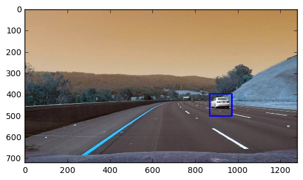
</p>

<p align="center">
 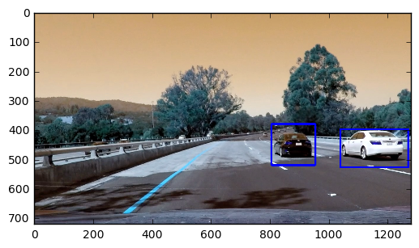
</p>

<p align="center">
 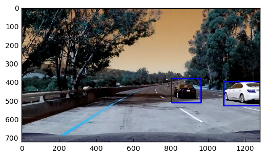
</p>

<p align="center">
 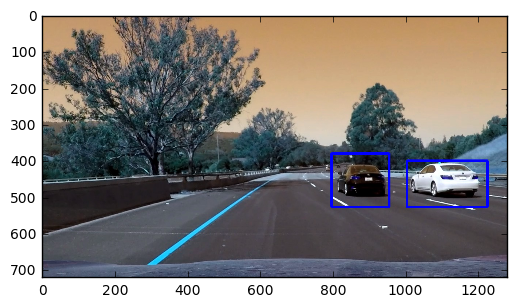
</p>


```python
# Define a function that takes an image,
# start and stop positions in both x and y, 
# window size (x and y dimensions),  
# and overlap fraction (for both x and y)
def slide_window(img, x_start_stop=[None, None], y_start_stop=[None, None], 
                    xy_window=(64, 64), xy_overlap=(0.5, 0.5)):
    # If x and/or y start/stop positions not defined, set to image size
    if x_start_stop[0] == None:
        x_start_stop[0] = 0
    if x_start_stop[1] == None:
        x_start_stop[1] = img.shape[1]
    if y_start_stop[0] == None:
        y_start_stop[0] = 0
    if y_start_stop[1] == None:
        y_start_stop[1] = img.shape[0]
    # Compute the span of the region to be searched    
    xspan = x_start_stop[1] - x_start_stop[0]
    yspan = y_start_stop[1] - y_start_stop[0]
    # Compute the number of pixels per step in x/y
    nx_pix_per_step = np.int(xy_window[0]*(1 - xy_overlap[0]))
    ny_pix_per_step = np.int(xy_window[1]*(1 - xy_overlap[1]))
    # Compute the number of windows in x/y
    nx_windows = np.int(xspan/nx_pix_per_step) - 1
    ny_windows = np.int(yspan/ny_pix_per_step) - 1
    # Initialize a list to append window positions to
    window_list = []
    # Loop through finding x and y window positions
    for ys in range(ny_windows):
        for xs in range(nx_windows):
            # Calculate window position
            startx = xs*nx_pix_per_step + x_start_stop[0]
            endx = startx + xy_window[0]
            starty = ys*ny_pix_per_step + y_start_stop[0]
            endy = starty + xy_window[1]
            # Append window position to list
            window_list.append(((startx, starty), (endx, endy)))
    # Return the list of windows
    return window_list

# Define a function to draw bounding boxes
def draw_boxes(img, bboxes, color=(0, 0, 255), thick=6):
    # Make a copy of the image
    imcopy = np.copy(img)
    # Iterate through the bounding boxes
    for bbox in bboxes:
        # Draw a rectangle given bbox coordinates
        cv2.rectangle(imcopy, bbox[0], bbox[1], color, thick)
    # Return the image copy with boxes drawn
    return imcopy

def find_cars(img, windows, svc, feature_scaler, confidence):
    result = []
    for window in windows:
        window_image = cv2.resize(img[window[0][1]:window[1][1], window[0][0]:window[1][0]], (64, 64))
        img_features = single_img_features(window_image)
        test_features = feature_scaler.transform(img_features)
        prediction = svc.predict(test_features)
        conf = svc.decision_function(test_features)
        if prediction == 1 and conf > confidence:
            result.append(window)
    return result

def add_heat(image, bbox_list):
    heatmap = np.zeros_like(image[:,:,0]).astype(np.float)
    # Iterate through list of bboxes
    for box in bbox_list:
        # Add += 1 for all pixels inside each bbox
        # Assuming each "box" takes the form ((x1, y1), (x2, y2))
        heatmap[box[0][1]:box[1][1], box[0][0]:box[1][0]] += 1
    # Return updated heatmap
    return heatmap

def apply_threshold(heatmap, threshold):
    # Zero out pixels below the threshold
    heatmap[heatmap <= threshold] = 0
    # Return thresholded map
    return heatmap

def draw_labeled_bboxes(img, labels):
    # Iterate through all detected cars
    for car_number in range(1, labels[1]+1):
        # Find pixels with each car_number label value
        nonzero = (labels[0] == car_number).nonzero()
        # Identify x and y values of those pixels
        nonzeroy = np.array(nonzero[0])
        nonzerox = np.array(nonzero[1])
        # Define a bounding box based on min/max x and y
        bbox = ((np.min(nonzerox), np.min(nonzeroy)), (np.max(nonzerox), np.max(nonzeroy)))
        # Draw the box on the image
        cv2.rectangle(img, bbox[0], bbox[1], (0,0,255), 6)
    # Return the image
    return img
```


```python
class Pipeline:
    def __init__(self, svc, scaler, confidence, heat_threshold, 
                 heatmap_history_count=0, start=0, end=-1, debug=False):
        self.svc = svc
        self.scaler = scaler
        self.confidence = confidence
        self.heat_threshold = heat_threshold
        self.heatmap_history_count = heatmap_history_count
        self.heatmap_history = deque([])
        self.debug = []
        self.img_count = 0
        self.start = start
        self.end = end
        self.debug = debug

    def check_operational_window(self):
        retval = True
        if self.start > 0:
            if self.img_count < self.start:
                retval = False      
        if self.end != -1:
            if self.img_count > self.end:
                return False
        return retval
                
    def apply_labels(self, heatmap):
        labels = None
        if self.heatmap_history_count > 0:
            # standardise heatmap -
            heatmap_std = heatmap.std(ddof=1)
            if heatmap_std != 0.0:
                heatmap = (heatmap-heatmap.mean())/heatmap_std
            heatmap = apply_threshold(heatmap, np.max([heatmap.std(), 1]))
            self.heatmap_history.append(heatmap)
            if len(self.heatmap_history) > self.heatmap_history_count:
                self.heatmap_history.popleft()
            hh = np.array(self.heatmap_history)
            # create a structure for connectivity
            s = generate_binary_structure(hh.ndim, hh.ndim)
            labels = label(hh, s)
        else:
            labels = label(heatmap)
        return labels

    def detect_bboxes(self, labels):
        bboxes = []
        # Iterate through all detected cars
        for car_number in range(1, labels[1]+1):
            # Find pixels with each car_number label value
            nonzero = (labels[0] == car_number).nonzero()
            # Identify x and y values of those pixels
            nonzeroz = np.array(nonzero[0])
            nonzeroy = np.array(nonzero[1])
            nonzerox = np.array(nonzero[2])

            nonzerox_min = np.min(nonzerox)
            nonzerox_max = np.max(nonzerox)
            nonzeroy_min = np.min(nonzeroy)
            nonzeroy_max = np.max(nonzeroy)
            nonzeroz_min = np.min(nonzeroz)
            nonzeroz_max = np.max(nonzeroz)

            # only add if they appear in contiguous planes
            nplane_min_threshold = self.heatmap_history_count - 1
            nplanes = nonzeroz_max-nonzeroz_min+1
            if nplanes >= nplane_min_threshold:
                bbox = ((nonzerox_min, nonzeroy_min),
                        (nonzerox_max, nonzeroy_max))
                bboxes.append(bbox)
        return bboxes

    def draw_detected_bboxes(self, img, bbox_list):
        for bbox in bbox_list:
            # Draw the box on the image
            cv2.rectangle(img, bbox[0], bbox[1], (0,0,255), 6)
        # Return the image
        return img

    def write_debug_image(self, img, count):
        out_file = './debug/' + str(count) + '.png'
        cv2.imwrite(out_file, img)
          
    def process_image(self, image):
        self.img_count = self.img_count + 1
        if self.check_operational_window() == False:
            return np.zeros_like(image).astype(np.float)
        """
        1. Pick windows in the image.
        2. Check if those windows have cars.
        3. Draw bounding boxes on those.
        """
        windows = []
        windows = slide_window(image, x_start_stop=[300, None], y_start_stop=[380, 480],
                                           xy_window=(96, 96), xy_overlap=(0.9, 0.9))
        windows += slide_window(image, x_start_stop=[300, None], y_start_stop=[400, 500],
                                           xy_window=(128, 128), xy_overlap=(0.8, 0.8)) 
        windows += slide_window(image, x_start_stop=[300, None], y_start_stop=[430, 550],
                                           xy_window=(144, 144), xy_overlap=(0.8, 0.8))  
        windows += slide_window(image, x_start_stop=[300, None], y_start_stop=[460, 580],
                                           xy_window=(192, 192), xy_overlap=(0.8, 0.8))
        car_windows = find_cars(image, windows, self.svc, self.scaler, self.confidence)
        # Add heat to each box in box list
        heat = add_heat(image, car_windows)  
        # Apply threshold to help remove false positives
        heat = apply_threshold(heat, self.heat_threshold)
        draw_img = None
        if self.heatmap_history_count > 0:
            labels = self.apply_labels(heat)
            bboxes = self.detect_bboxes(labels)
            draw_img = self.draw_detected_bboxes(np.copy(image), bboxes)
        else:
            labels = label(heat)
            draw_img = draw_labeled_bboxes(np.copy(image), labels)
        if self.debug == True:
            self.write_debug_image(draw_img, self.img_count)
        return draw_img

def process_test_images():
    svc, scaler = load_model()
    pipeline = Pipeline(svc, scaler, 0.6, 2)
    test_images = glob.iglob('./test_images/*.jpg', recursive=True)

    test_output = []
    for image in test_images:
        test_image = cv2.imread(image)
        test_output.append(pipeline.process_image(test_image))

    for output_image in test_output:
        plt.imshow(output_image)
        plt.show() 
        
process_test_images()
```

## Project Video

We run our pipeline on the project video. Here is a link to the output - https://youtu.be/8zgBPJ-fV50


```python
def process_video():
    svc, scaler = load_model()
    white_output = 'project_video_out.mp4'
    clip1 = VideoFileClip('project_video.mp4')
    pipeline = Pipeline(svc=svc, scaler=scaler, confidence=0.6, 
                        heat_threshold=2, heatmap_history_count=5)
    white_clip = clip1.fl_image(pipeline.process_image)
    white_clip.write_videofile(white_output, audio=False)

process_video()	
```

## Discussion

I think this project is a great way to understand the pros and cons of a computer vision based solution for vehicle detection. In this project we trained a classifier to classify vehicles. While the classifier is generic, all the subsequent logic for sliding windows, heat map etc. are so specific to the images we are testing. So if i ran my pipeline on different video from a different camera angle or different dimensions it won't work.

So a more generic approach could be:


- Run this pipeline and generate some labeled data for vehicle locations.
- Train a CNN to predict vehicle locations (i do not know how to setup an error function that does this, but i think it is doable). This means we do not need to tune window searches.
- Once a vehicle is "locked", we can use template matching to keep finding that vehicle and need not use a full sliding window approach.

